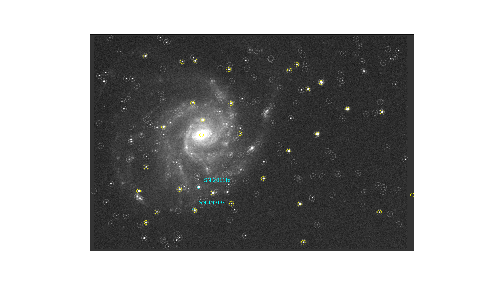

# astropy affiliated packages

One of the things I both love and hate about Python is that there is almost
always more than one way to get a job done. When I first switched to Python I
found that really frustrating. Of the three (or four or five or six) astronomy
packages, which one was "the" package to use? Or was I supposed to use the
more fundamental tools, like [numpy](http://www.numpy.org/) or
[scipy](https://scipy.org/)? Now that I've been using Python for a few years,
I've come to appreciate the diversity of tools.

I was reminded of this by a recent [NumFOCUS blog post about doing astronomy with Python and open data](https://www.numfocus.org/blog/anyone-can-do-astronomy-with-python-and-open-data/) which outlined how to use several
fundamental packages to do image reduction and photometry. Here I'll give an
overview of several high-level packages for doing astronomy that are
[Astropy](http://astropy/org) *affiliated packages*; these are packages that
follow the same coding, documentation and testing conventions as the core
[astropy package](http://astropy.readthedocs.io). The full list of affiliated
packages is on the [Astropy project's website](http://www.astropy.org/affiliated/index.html).

I'll give a quick overview of the packages and then wrap up with some
installation instructions. I've only mentioned each package once in the
description below, even though several really cross categories.

Some good news/bad news before we start: there are almost thirty affiliated
packages, and there are many very good astronomy-related packages that are
*not* affiliated packages. The menu of interesting Python packages only seems to
increase.

## Optical/IR image processing

|  |
| :---------------: |
| Reduced, reprojected, stacked image with overlay of sources detected by photutils and two catalogs from Vizier. |
| *Courtesy of ccdproc, astropscrappy, reproject, photutils, and astroquery -- clik on the image for an animation!* |

[ccdproc](http://ccdproc.readthedocs.io/) does reduction of optical/IR image
data and may be suitable for reducing some spectroscopic data. It
(optionally) includes cosmic ray removal with [astroscrappy](https://github.com/astropy/astroscrappy), a fast implementation of the L.A.Cosmic algorithm.

More specialized, but in the same genre, is [python-cpl](http://python-cpl.readthedocs.io/), a python interface to recipes of
the ESO data reduction pipeline.

Once you've calibrated your images,
[photutils](http://photutils.readthedocs.io/) can be used to do source
detection and aperture and PSF photometry. If you need to stack those images
first, try [reproject](http://reproject.readthedocs.io/) which can align them
for you if the images have WCS headers.

You probably want to look at all of those nice images you are working with, so
up next is...

## Image viewers and plotting helpers

[ginga](http://ginga.readthedocs.io/) provides by a "reference" viewer and the
libraries for making your own image viewer or for customizing the reference
viewer. If you use IRAF you should check out
[imexam](http://imexam.readthedocs.io/), which duplicates the functionality of
the IRAF tool of the same name.

|  |
| :===============: |
| Coming soon to a notebook near you: ginga-based image viewer widget... |

[APLpy](http://aplypy.readthedocs.io/) (pronounced "apple pie") makes it easy
to prepare publication-quality plots of images with lots of options for
annotating them or overlaying additional information. Finally, [montage-wrapper](http://www.astropy.org/montage-wrapper/) provides a python interface
[to the Montage image mosaic system](http://montage.ipac.caltech.edu/)
(Montage itself is developed and maintained by IPAC and is not an affiliated
package).

There are two packages for interacting with regions on the sky:
[pyregion](http://pyregion.readthedocs.io/), which handles ds9 and ciao region
files and helps you overlay them on [matplotlib](https://matplotlib.org/)
images, and the more general [regions](http://regions.readthedocs.io/), which
is still in the very early stages of development. Rounding out this category is [spherical-goemetry](http://spacetelescope.github.io/sphere/spherical_geometry/index.html) for representing spherical polygons on the sky.

## Glue

Though it can display images, [glueviz](http://www.glueviz.org) is really a
much more general tool. It allows you create links between plots so that you
can, say, select stars on part of a color-magnitude diagram and see those
points highlighted on an image of the region containing those stars.

## Optical spectroscopy

The [specutils](http://specutils.readthedocs.io/) package provides tools for
working  with 1-D spectra; it is undergoing rapid development, described in
detail in a [proposal for the future of spectroscopy in astropy](https://github.com/astropy/astropy-APEs/pull/23), but currently
provides tools for reading and writing spectra in a variety of formats, and
for performing common operations. A couple of packages in the early stages of
developments (they are not affiliated packages yet) are
[specreduce](http://specreduce.readthedocs.io/), for reducing spectra, and
[specviz](http://specviz.readthedocs.io/) for viewing those spectra.

[omnifit](https://github.com/RiceMunk/omnifit) performs spectroscopic fitting
of interstellar ices.

Finally, [gwcs](http://gwcs.readthedocs.io/) is being developed both to handle celestial for the James Webb Space Telescope and to provide a framework for spectral coordinates. It provides a framework for carrying out a sequence of transforms from one set of coordinates to another.

## Theory

As a former theorist myself, it is exciting to see so many theory and
simulation packages. If you want to do galactic dynamics in python,
[galpy](http://galpy.readthedocs.io/) is for you; it includes a wide variety
of potentials and sampling of distribution functions.

[asro-gala](http://gala.adrian.pw/), which also does gravitational dynamics,
contains several general-purpose integrators and tools for carrying out
several coordinate and velocity transforms in our galaxy.

[cluster-lensing](http://jesford.github.io/cluster-lensing) computes galaxy
cluster halo properties and weak lensing profiles.

If a single cluster isn't enough for you, use
[halotools](http://halotools.readthedocs.io/) to construct your own mock
universe. Given a set of dark matter halos from a simulation, it can populate
those halos with galaxies and make measurements on them.

## Crossover appeal

A few packages don't fit neatly into a single category.

One is [astroML](http://www.astroml.org/) which contains a variety of astronomy-related machine learning tools, and even has an [extensive user's manual on Amazon](https://www.amazon.com/Statistics-Mining-Machine-Learning-Astronomy/dp/0691151687/ref=sr_1_sc_2?ie=UTF8&qid=1499479180&sr=8-2-spell&keywords=vander+plas).

Another is [sncosmo](http://sncosmo.readthedocs.io/), which makes supernova
light curve models, including fitting photmetric data to a model. There are a
variety of models and passbands to choose from. This one has been extremely
useful to an undergraduate I've been working with this summer to (finally)
reduce and analyze the data we have on SN 2011fe.

Those coming from IDL may be interested in
[PyDL](http://pydl.readthedocs.io/en/latest/pydl/index.html), which contains
Python implementations of some widely-used astronomical routines from IDL,
with an emphasis on access to
[Sloan Digital Sky Survey (SDSS)](https://www.sdsss.org) data, and
tools from the [IDL Astronomy User's Library](https://idlastro.gsfc.nasa.gov/), also known as the "Goddard Library".

## Spectral extremes

The long and short ends of the electromagnetic spectrum get some special attention.

On the high energy side are [gammapy](http://docs.gammapy.org/), providing a
quite complete set of tools for both simulation and analysis of gamma ray
data. At a slightly lower energy, [maltpynt](http://maltpynt.readthedocs.io/)
has some general-purpose tools for x-ray astronomy, but its primary purpose is
for timing analysis of [NuSTAR](http://www.nustar.caltech.edu/) data. Finally,
[naima](http://naima.readthedocs.io) calculates non-thermal spectra of
relativistic particle distributions.

Radio astronomers should check out [spectral-cube](http://spectral-cube.readthedocs.io/), which  supports
working with data cubes with two spatial and one spectral dimension, including
tools for masking, extracting subarrrays, and working with data sets too large
for memory.

## Planning and data access

Need some visibility or airmass plots? Or maybe some finder charts? Take a
look at [astroplan](http://astroplan.readthedocs.io/), which does those things
with minimal effort.

With [pyvo](http://pyvo.readthedocs.io/), everything available through the
Virtual Observatory is available via python.

The [hips](https://hips.readthedocs.io) Python package lets you fetch
[HiPS](http://aladin.u-strasbg.fr/hips/) image tiles from astronomical data
centers for any astronomical survey and sky region you like. It then stitches
the tiles together and reprojects them into a sky image that you can save to
FITS, PNG or JPEG, or analyse directly from Python.

Which reminds me, there is...

## One more thing...

I've saved one of the best for last. No matter what your area of interest is
in astronomy you need access to online databases, and
[astroquery](http://astroquery.readthedocs.io/) has you covered. Simbad
lookups? Yep. Data from a Vizier table? Can do. Gaia catalog? Sure!
ALMA? No problem. Take a look at the [gallery of examples](http://astroquery.readthedocs.io/en/latest/gallery.html).

## Installation

Each of the packages above is on the [astropy conda channel](https://anaconda.org/astropy/repo) and on PyPI, the Python package
index. Navigating to the package on the conda channel will get you to specific
installation instructions, but they boil down to
`conda install -c astropy package_name`. With `pip` (i.e. if you do not
use conda), install with `pip install package_name`. I've tried to make sure the package names above match
the names on PyPI, i.e. the name given in the text is the name you use to install the package with `pip`.
